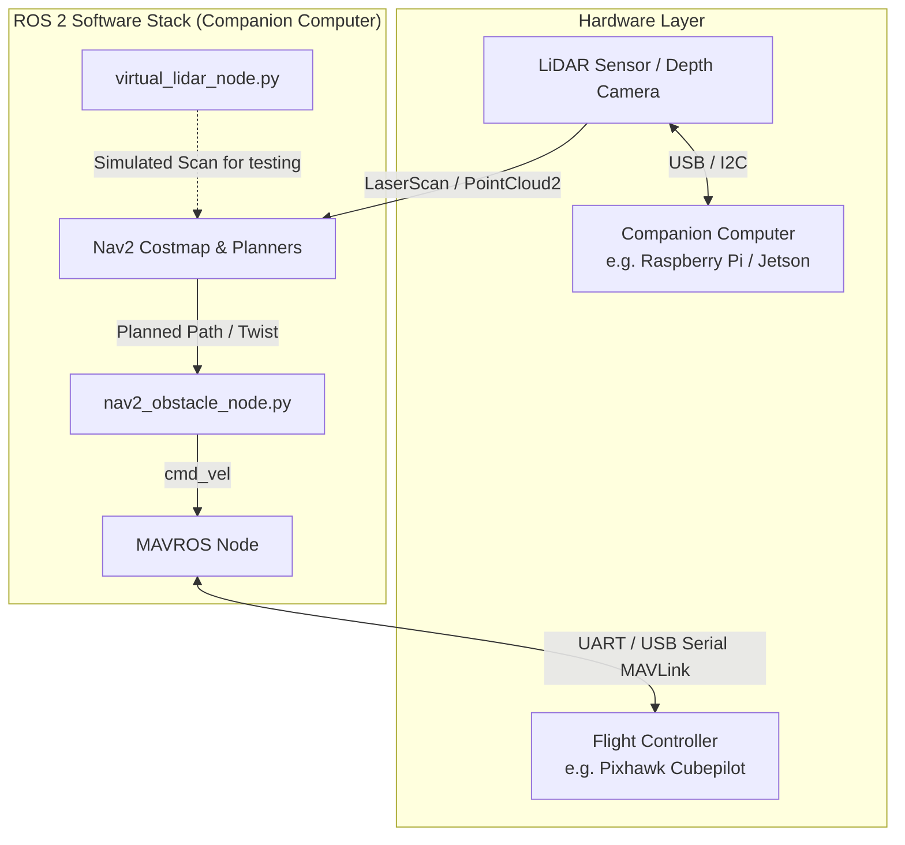

# Drone Autonomy in ROS 2 🚁

A complete ROS 2 autonomous drone navigation framework utilizing ArduPilot, MAVROS, and Nav2 for real-time path planning and dynamic obstacle avoidance. 

## 🌟 Key Features
- **ROS 2 Integration:** Fully built on the ROS 2 ecosystem.
- **ArduCopter & MAVROS:** Seamless flight control and telemetry streaming to offboard navigation nodes.
- **Nav2 Autonomy Stack:** Real-time path planning globally and locally using the Nav2 framework.
- **Dynamic Obstacle Avoidance:** Utilizes a LiDAR (or `virtual_lidar_node` in SITL) with Nav2 costmaps to dynamically dodge obstacles during flight.

## 🏗️ Hardware & Software Architecture Diagram

