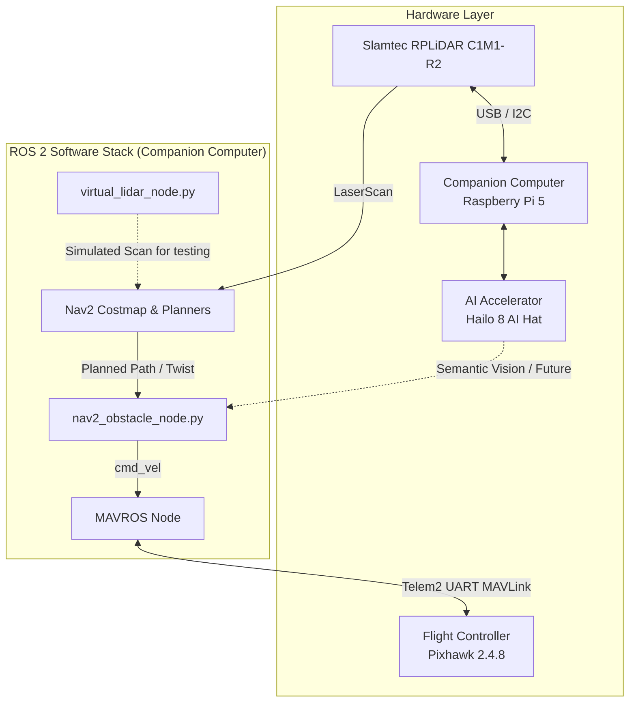

# Drone Autonomy in ROS 2 🚁

A complete ROS 2 autonomous drone navigation framework utilizing ArduPilot, MAVROS, and Nav2 for real-time path planning and dynamic obstacle avoidance. 

## 🌟 Key Features
- **ROS 2 Integration:** Fully built on the ROS 2 ecosystem.
- **ArduCopter & MAVROS:** Seamless flight control and telemetry streaming to offboard navigation nodes.
- **Nav2 Autonomy Stack:** Real-time path planning globally and locally using the Nav2 framework.
- **Dynamic Obstacle Avoidance:** Utilizes a LiDAR (or `virtual_lidar_node` in SITL) with Nav2 costmaps to dynamically dodge obstacles during flight.

## 🏗️ Hardware & Software Architecture Diagram

## 🧠 Obstacle Avoidance Algorithm & Sensor Setup

### Sensor Setup: 2D 360-Degree LiDAR
The system currently relies on a **2D 360-degree LiDAR** (such as the RPLiDAR C1) spinning at a fixed rate, which outputs a `/scan` topic covering all directions in a flat horizontal plane. The Nav2 framework takes this point cloud and maps it onto a real-time, cell-based 2D Costmap around the drone, artificially inflating the walls to create a buffer zone. 

### Custom Reactive Ego-Centric Sector Algorithm
Instead of standard path planning formulas (A*, DWB), this project uses a bespoke, high-performance logic optimized for ArduPilot's physics:
1. **Grid Extraction**: `nav2_obstacle_node.py` extracts a precise 100x100 cell window (representing the immediate flight zone) from the Nav2 Global Costmap.
2. **4-Way Sector Division**: The window is split into four ego-centric zones (Front, Left, Right, Back) relative to the drone's nose.
3. **Danger Evaluation**: If the 'Front' sector cost exceeds a calibrated safety threshold, the drone stops waypoint tracking.
4. **Reactive Escape**: It compares the 'Left' and 'Right' sector densities and injects high-priority MAVROS velocity (`Twist`) commands targeting the clearest path. 
5. **360-Degree Trapping**: If the Front, Left, and Right are all blocked, it verifies the 'Back' sector. If the back is clear, it dynamically reverses out of the dead end. If all 4 sectors are blocked (Full 360-degree trap), it executes a vertical `Twist` escape, climbing in altitude to fly over the dynamic trap!
