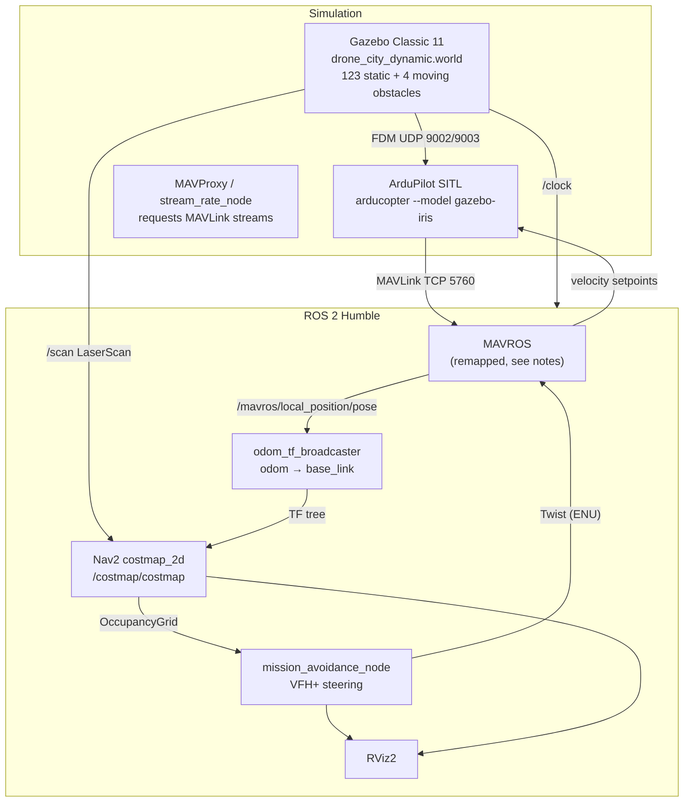

# Drone Autonomy in ROS 2 🚁

Autonomous 6-waypoint navigation with **dynamic obstacle avoidance**, a
**motion-prediction layer** that projects where moving obstacles will be, and
**smart retrace**, built on ROS 2 Humble + MAVROS + Nav2 costmaps, simulated
with ArduPilot SITL + Gazebo Classic 11, and visualised in RViz2.

```
ARM → TAKEOFF → WP1 … WP6  (live avoidance) → SMART RETRACE → LAND
```

## 🚀 Quick start

```bash
colcon build --packages-select drone_autonomy
./scripts/run_mission.sh            # headless Gazebo + RViz2
./scripts/run_mission.sh --gui      # with the Gazebo GUI
./scripts/run_mission.sh --stop     # tear everything down
```

The script sequences the whole stack in the one order that works, waits for the
FCU heartbeat, then streams the mission log. Logs land in `.run_logs/`.

Offline test of the avoidance maths (no simulator needed, ~5 s):

```bash
python3 src/drone_autonomy/test/test_avoidance.py
```

## 🏗️ Architecture

Three systems have to be bridged. **Gazebo Classic 11** is used, not Harmonic:
this machine already has a built `ardupilot_gazebo` Classic plugin and an Iris
model carrying an RPLiDAR, and `gazebo_ros`'s `libgazebo_ros_ray_sensor.so`
publishes `sensor_msgs/LaserScan` **natively into ROS 2** — so no `ros_gz_bridge`
is needed at all.



**Hardware target:** Pixhawk 2.4.8 · Raspberry Pi 5 · Slamtec RPLiDAR C1M1-R2 ·
Hailo-8 AI Hat (future semantic vision).

## 🧠 The avoidance algorithm (VFH+)

`mission_avoidance_node.py` runs a Vector Field Histogram in the **ENU frame** —
the same frame the costmap uses *and* the same frame MAVROS interprets velocity
setpoints in, so no hidden conversion remains.

1. **Polar histogram** — obstacles inside a 10 m disc are binned by their true
   bearing from the drone (72 bins × 5°), **fusing the raw `/scan` (primary,
   zero-latency) with the Nav2 costmap (persistent, inflated memory)** and taking
   the per-sector minimum. See note #8 for the flight data behind that choice.
2. **Angular enlargement** — each occupied bin widens by
   `γ = asin(safety_radius / distance)`. A pillar 2 m away blocks a far wider arc
   than the same pillar 15 m away. One line replaces a table of hand-tuned
   distance thresholds.
3. **Corridor selection** — a heading is only legal if a *corridor* around it is
   clear, not just the single bin pointing down it. Candidates are scored on
   deviation from the goal, plus hysteresis so the drone commits to one side of
   an obstacle instead of dithering across its centreline.
4. **Trap escape** — if no corridor survives, the drone is boxed in on all 360°
   and climbs, escalating every 4 s, to fly over the trap.
5. **Emergency reflex** — a last-ditch check reverses the drone if anything is
   inside 2 m of the chosen heading.

### Predicting where a moving obstacle will be

Steps 1–5 above are **static-geometry** reasoning: they ask which bearings are
free *right now*. Against something that moves, that is always one frame late —
note #16 covers being hit broadside by exactly this. The TTC reflex added there
patched the symptom, but it inherits a deeper limit: `nearest[72]` keeps only
each sector's range, so differencing it recovers **radial** closing rate and
throws away **tangential** motion — the component that says where the obstacle
is actually going.

The predictive layer keeps that component by tracking objects instead of
sectors:

1. **Cluster** — walk the raw scan in angular order and split wherever a beam is
   invalid or the range steps by more than `track_cluster_gap`. Clusters below
   `track_min_points` beams are speckle. The ±180° seam is merged so an object
   straddling it is one cluster, not two.
2. **Associate** — greedy nearest-neighbour against each track's dead-reckoned
   position `pos + vel·dt`, gated by `track_assoc_radius`.
3. **Estimate** — a fixed-gain **alpha-beta filter** per track, the
   constant-velocity estimator that costs two multiplies and no matrix:

   ```
   pred  = pos + vel·dt
   resid = measurement − pred
   pos   = pred + α·resid
   vel   = vel  + (β/dt)·resid
   ```

4. **Project** — for a track with velocity, the **closest point of approach**
   against the drone's own velocity has a closed form:

   ```
   t_cpa = −(Δp · Δv) / |Δv|²        d_cpa = |Δp + Δv·t_cpa|
   ```

   Two degenerate cases have to be caught rather than divided through:
   `|Δv| ≈ 0` is an obstacle station-keeping alongside, and `t_cpa ≤ 0` means the
   closest approach is in the *past* — the pair is already opening.

A warning is raised only if the track is confirmed over `track_confirm_frames`,
is currently moving (`track_min_speed … track_max_speed` — stationary scenery is
VFH's job), intercepts within `cpa_horizon_s`, and misses by less than
`cpa_miss_distance`.

The layer is **strictly additive**: `predict_threat()` is consulted only when
`imminent_collision()` found nothing, so the reflex keeps first refusal and
prediction can only ever *add* warnings the reflex would have missed. In flight
it fires several seconds ahead of the reflex:

```
🔮 PREDICTED INTERCEPT — 6.6 m at 149°, CPA in 4.9 s
🔮 PREDICTED INTERCEPT — 4.2 m at 147°, CPA in 3.4 s
🔮 PREDICTED INTERCEPT — 1.9 m at 138°, CPA in 1.7 s
```

**What this does and does not buy.** Detection is genuinely earlier and it is
repeatable. The *response* to that warning is still the same emergency brake,
and braking answers a **crossing** obstacle, not a **pursuing** one — under the
4 m ceiling a closing obstacle has nowhere to go. Earlier detection is a
prerequisite for a better response, not a better response by itself. See
[Verified end-to-end](#-verified-end-to-end) for what that means for mission
reliability.

### Smart retrace

Outbound, the drone drops a breadcrumb every 4 m **only at moments when its path
was clear**, so the trail describes a corridor known to be flyable. The return
leg walks those breadcrumbs in reverse rather than re-solving the maze — with
avoidance still fully armed, so obstacles that moved in behind it are dodged.

### Why the previous algorithm was replaced

The old `nav2_obstacle_node` sliced the costmap into four axis-aligned rectangles
labelled Front/Left/Right/Back "relative to the drone's nose". They were not:

```python
front = costmap[cy-gap : cy+gap,  cx : cx+radius]   # always +x of the costmap
```

The costmap lives in `odom` (ENU), so "front" meant **due East, permanently**,
regardless of heading. Avoidance only behaved sensibly on an eastbound leg.

## 🌍 The world

`worlds/drone_city_dynamic.world` — 123 static models plus 4 moving blocks:

| Zone | Gazebo coords | Obstacles | At 4 m cruise |
|---|---|---|---|
| Skyscrapers | x,y ∈ 30…90 | 16 towers, 26–49 m, 8 m corridors | blocking |
| Suburbs | x −45…0, y −40…−10 | houses + roofs to 7.5 m | blocking |
| Containers | x 35…59, y −60…−40 | stacks to 4.8 m | blocking |
| Park | x −84…−15, y 7…74 | 40 trees, 3.1 m | **below** cruise |
| Bridge | y ≈ 70 | deck 0–16.5 m | blocking |

Moving obstacles are driven through `/gazebo/set_entity_state` rather than
Gazebo `<actor>` animations: an actor moves only its *visual* skeleton, leaving
collision geometry at the origin, so a ray sensor never sees it — it would look
convincing in the GUI while the drone flew straight through.

Waypoints sit in free space; the **legs between them** deliberately cross
obstacle fields.

## ⚙️ Configuration

| File | Purpose |
|---|---|
| `config/mission_params.yaml` | waypoints, cruise altitude, VFH tuning, retrace |
| `config/nav2_params.yaml` | costmap frames, layers, aerial height filtering |
| `config/mavros_pluginlists.yaml` | **required** MAVROS plugin allowlist |
| `config/sitl_defaults.parm` | ArduCopter stream rates + GUIDED tuning |
| `config/drone_mission.rviz` | RViz2 layout |

Waypoints are authored in **Gazebo world coordinates** (what you see in the GUI)
and converted internally. The ArduPilot plugin declares a 180° roll in
`<gazeboXYZToNED>`, giving `ENU = (−gz_y, +gz_x, +gz_z)`. Set
`waypoint_frame: 'enu'` to bypass the conversion.

### Predictive-layer knobs

Set `enable_prediction: false` to disable the tracker entirely and fall back to
the reflex-only behaviour of note #16.

| Parameter | Default | Meaning |
|---|---|---|
| `track_cluster_gap` | 0.8 m | range step that separates two objects |
| `track_min_points` | 3 beams | fewer is speckle, not an object |
| `track_assoc_radius` | 1.2 m | how far a centroid may move between frames |
| `track_confirm_frames` | 4 | associations before the velocity is believed |
| `track_max_age_s` | 0.6 s | unseen → forget it, rather than dead-reckon |
| `track_min_speed` | 0.35 m/s | below this it is scenery; VFH handles it |
| `track_max_speed` | 5.0 m/s | above this the association is wrong |
| `track_alpha` / `track_beta` | 0.5 / 0.25 | alpha-beta position / velocity gains |
| `track_max_count` | 12 | bounds association cost on a busy street |
| `cpa_horizon_s` | 5.0 s | ignore intercepts further off than this |
| `cpa_miss_distance` | 2.0 m | a predicted gap tighter than this is a hit |

The two age-related limits carry most of the weight. `track_max_age_s` is short
on purpose — a track that coasts on dead reckoning behind a building is how a
confidently wrong answer gets produced — and `cpa_horizon_s` is short because
constant velocity models a block on a straight patrol leg well and its
turnaround badly.

---

## 🔧 Integration notes — bugs found and fixed

These were real defects that silently broke the stack. Documented because each
one *looks* like a different problem than it is.

### 1. The costmap was permanently empty

`nav2_params.yaml` indented `global_frame` at the **same level** as
`ros__parameters`, making every setting a sibling rather than a child.
`ros__parameters` parsed as `None`, so the costmap ran on stock defaults —
including `max_obstacle_height: 2.0`. The laser sits at ~4.25 m in `odom`, so
**100 % of returns were height-filtered** and the costmap never contained a
single obstacle. Obstacle avoidance could not trigger, ever.

Fixed, plus the key had to be nested `costmap: costmap:` — the standalone
`nav2_costmap_2d` executable constructs `Costmap2DROS("costmap")`, which places
the node in a namespace equal to its own name (`/costmap/costmap`). The
lifecycle manager needs `'costmap/costmap'` for the same reason; given plain
`'costmap'` it waits on `costmap/get_state` forever, and a lifecycle node
publishes *nothing* until activated.

For an aerial platform the height bounds are now opened wide (±100 m): a drone
changes altitude constantly, so filtering its horizontal laser by height is
actively harmful.

### 2. MAVROS flattens every plugin topic

This MAVROS build's plugin sub-namespacing is broken. Endpoints land under the
UAS node instead of per-plugin namespaces:

| Documented | Actual in this build |
|---|---|
| `/mavros/local_position/pose` | `/mavros/mavros/pose` |
| `/mavros/setpoint_velocity/cmd_vel_unstamped` | `/mavros/mavros/cmd_vel_unstamped` |
| `/mavros/cmd/arming` | `/mavros/mavros/arming` |

It breaks MAVROS's **own** wiring: the version plugin registers a client on
`/mavros/cmd/command` while the command plugin serves `/mavros/mavros/command`,
which is the source of the `VER: command plugin service call failed!` spam.

`sim_launch.py` carries remappings that restore the documented names.

### 3. `mavros_node` aborted on startup

Flattening also makes plugin *leaf* names collide, which kills the process:

```
create_subscription() called for existing topic name rt/mavros/mavros/status
with incompatible type mavros_msgs::msg::dds_::CompanionProcessStatus_
terminate called after throwing an instance of RCLError
```

Three plugins claim `status` (`cellular_status`, `companion_process_status`,
`mag_calibration_status`); two claim `local` (`local_position` ↔
`setpoint_position`, which are therefore **mutually exclusive**). A bare
`ros2 run mavros mavros_node` aborts identically — nothing in this project
caused it, and the stock `apm_pluginlists.yaml` denies none of the offenders.
`config/mavros_pluginlists.yaml` pins a working allowlist.

### 4. ArduPilot sent nothing but HEARTBEAT

ArduPilot transmits only HEARTBEAT until a GCS requests streams. MAVProxy does
this automatically — which is why the problem is invisible via `sim_vehicle.py`
— but MAVROS 2 does not. Verified with pymavlink: 8 s of listening yielded only
HEARTBEAT/TIMESYNC; one `REQUEST_DATA_STREAM` produced 12 message types at
~12 Hz.

Consequence chain: no `LOCAL_POSITION_NED` → no `/mavros/local_position/pose` →
no `odom → base_link` TF → Nav2 discards every laser return → empty costmap →
the drone believes the world is clear. The visible symptom is "avoidance doesn't
work"; the cause is three layers down.

`stream_rate_node.py` sends `MAV_CMD_SET_MESSAGE_INTERVAL` on connect.
`/mavros/set_stream_rate` was tried first — it returns success and does nothing —
as were `SR0_*` parameters, which did not stick even after an EEPROM wipe.

### 5. SITL blocks until a MAVLink client attaches

ArduPilot SITL parks at `Waiting for connection ....` and does not run its main
loop until something connects. No client → no servo packets → Gazebo logs
`Broken ArduPilot connection` on a loop. Those warnings *before* MAVROS connects
are expected, not a fault. Pointing MAVROS at `udp://…:14550` with no MAVProxy
running looks exactly like a Gazebo failure but is a MAVLink one.

### 6. The scan frame is not what the SDF says

Gazebo Classic prefixes the model name onto the sensor frame, so `/scan` arrives
stamped **`iris_demo::laser_link`**, not the `laser_link` written in the model's
`<frame_name>`. Hard-coding `sensor_frame: laser_link` in the costmap silently
drops every observation. The field is now left unset so nav2 uses the message's
own `frame_id`, and static TFs are published for both spellings.

### 7. Avoidance steered into a needle gap

The corridor check accepted the goal bearing whenever its own bin was free, even
with both neighbours blocked — the drone aimed at a gap narrower than itself,
logging `steering RIGHT (1° off goal)` immediately before clipping a building.
Headings now require symmetric clearance; covered by test 3.

`safety_radius` was also retuned 1.6 → 1.0 m: the costmap inflation layer already
blocks ~0.8 m around every obstacle at `blocked_cost: 60`, so 1.6 m stacked to a
2.4 m effective radius and refused the 8 m skyscraper corridors.

### 8. The costmap was too slow to fly on

With everything above fixed the drone still flew into a skyscraper — and the
mission log showed `ahead clear | CRUISE` right up until the raw-scan emergency
reflex fired at 2 m. Instrumenting scan-vs-costmap through the approach showed
the costmap simply did not contain the building:

```
pos=(-16.4, 48.4)   SCAN  7.62 m @181°   COSTMAP 16.11 m    630 cells
pos=(-21.8, 51.0)   SCAN  2.25 m @181°   COSTMAP 22.37 m    157 cells
pos=(-23.9, 52.3)   SCAN  0.30 m @204°   COSTMAP  9.92 m   8056 cells
```

The LiDAR tracked the wall in cleanly from 7.6 m to contact while the costmap
reported open space and only caught up *after* impact. A costmap is a filtered,
TF-gated, buffered product: an observation must survive a TF lookup at the
scan's timestamp, a buffer purge, a raytrace-clear pass and a publish cycle
before it is visible. At cruise speed that pipeline delay is metres of travel —
and nothing in it logs a warning when it loses the race.

The histogram now fuses **both** sources, taking the per-sector minimum:

- **raw `/scan`** — primary. One message, no TF, no buffering; the same data VFH
  was originally designed to consume.
- **Nav2 costmap** — secondary. It still earns its place: it remembers obstacles
  that have left the current sweep or fallen outside LiDAR range, and it carries
  the inflation layer.

Whichever source sees danger first wins, which is the correct bias for a safety
check. This is what turned a repeatable crash into a completed mission.

### 9. Altitude ratcheted up until the drone flew over the course

The trap handler added `escape_step` to the target altitude on *any single*
trapped tick, and its `trapped_since` latch was cleared by the very next clear
tick. In cluttered terrain the histogram flickers in and out of "no legal
corridor" several times a second, so altitude ratcheted +3 m far faster than it
could bleed off — one mission logged **207 trap events** and spent most of its
length pinned at `max_escape_altitude`, cruising over the city instead of
weaving through it.

A trap must now persist for `trap_confirm_s` (0.6 s) before it earns a climb,
which costs nothing (the drone is stopped and climbing gently either way) and
distinguishes a real dead end from momentary sensor geometry. The descent side
is a **decay, not a latch**: the target bleeds back toward cruise on every clear
tick, so the two behaviours servo against each other and no state can stick.
Two earlier designs — "clear for N continuous seconds", then a decaying-credit
counter — both lost the race whenever dodges were frequent.

### 10. Durations were measured on the wall clock

Every timer in the mission node used `time.time()` while the whole stack runs
`use_sim_time:=true`. That is wrong twice: the simulation does not run at
real-time speed, so a "12 second" takeoff settle was 12 wall seconds but only
~6 seconds of simulated flight; and a host clock step corrupts every elapsed
calculation — one run reported a mission duration of **22936 s** after an NTP
adjustment mid-flight. All durations now come from a `now()` helper backed by
the ROS clock.

### 11. The autopilot took the aircraft and the node kept narrating

A live run reached WP4 fine, then the FCU log showed:

```
FCU: EKF Failsafe: changed to Land Mode
FCU: Crash: Disarming: AngErr=168>30, Accel=2.0<3.0
FCU: Disarming motors
```

ArduPilot's estimator diverged, the failsafe force-switched **out of GUIDED
into LAND**, the drone came down uncontrolled and flipped (`AngErr=168°` — it
was upside down), and the crash detector disarmed it.

The node noticed none of this. It kept publishing velocity setpoints and
logging `CRUISE | ahead clear` for ~90 s over a wrecked, disarmed airframe,
because it subscribed to `/mavros/state` but never checked `mode` or `armed`
once the mission was underway. It now aborts loudly on either condition and
stops fighting the FCU's own failsafe with stale setpoints.

### 12. The avoidance oscillated hard enough to break the EKF

The EKF divergence above was **self-inflicted**. On that leg 137 dodges fired
and **61 of them commanded course changes over 80°**, in sequences like

```
LEFT(136°) → RIGHT(55°) → LEFT(105°) → RIGHT(70°)
```

within a couple of seconds. Slamming the velocity vector around like that,
on top of a yaw slew running at up to 86 °/s, is precisely the input that
produced ArduPilot's `Check mag field (xy diff:159>100)` and
`EKF3 Roll/Pitch inconsistent` complaints. Obstacles do not move that fast —
the oscillation was ours.

Three changes damp it:

- `hysteresis_weight` 0.35 → **0.8**, so the drone commits to one side of an
  obstacle instead of re-deciding every tick.
- **`max_heading_rate` (90 °/s)** caps how fast the commanded course may slew,
  so no single tick can snap 136°.
- **Yaw is nearly free to give up.** The LiDAR is a full 360° sensor, so nose
  direction buys nothing for perception — it is cosmetic, and it is not free.
  The gain is halved, the rate capped 1.5 → 0.6 rad/s, and yaw is **frozen
  outright while avoidance is actively steering** and during a vertical trap
  escape, which are exactly the moments the estimator can least afford extra
  rotation.

This is worth stating plainly: "the mission completed" is not the same as
"the drone flew well". Four runs completed end-to-end before this failure mode
surfaced, because completion was the only thing being measured.

### 13. The livelock watchdog measured the wrong thing

With the oscillation damped (#12) a new failure appeared: approaching WP6
through the suburb, the drone entered a permanent `AVOIDING` state and tracked

```
34.9 → 37.0 → 33.5 → 50.2 → 46.1 m to go
```

sliding back and forth along the obstacle face without ever getting closer. It
would have orbited that local minimum indefinitely.

The `check_stuck` watchdog that exists precisely to catch this stayed silent,
because it measured **displacement** — and displacement was large in every
window. It only ever fired when the drone was pinned nearly motionless.

It now measures **progress toward the goal**: if the closest approach to the
current target has not improved by 1 m in `stuck_timeout_s` (15 s), the drone
climbs. That is the right escape for a reactive planner — VFH has no global
view and *will* find local minima, so the way out is to leave the plane it is
trapped in. The suburb roofs top out at 7.5 m against a 4 m cruise, so a single
climb step converts the dead end into open air.

### 14. The 2D costmap has no height, and it poisoned the escape climb

Fixing the livelock (#13) exposed the deepest bug in the stack. The drone would
climb to escape, then hang forever. Live query at that moment:

```
drone ENU=(-1.5, 44.0, 22.0)   dist_to_WP1 = 4.3 m
scan returns within 10 m lookahead: 0
```

Empty sky, 4.3 m from the waypoint — and the node still reported `AVOIDING`
and orbited indefinitely.

The Nav2 costmap was vetoing the goal direction using **buildings recorded at
4 m, which the drone was now 18 m above**. A costmap is a flat 2D projection
with no concept of height: it accumulates every obstacle ever observed, at
whatever altitude the drone happened to be flying. Worse, the marks are
*immortal* up there — a horizontal LiDAR at 22 m returns nothing, so no
raytrace ever arrives to clear them.

This makes the whole vertical-escape strategy self-defeating: the drone climbs
specifically to get above an obstacle, and the map then insists the obstacle is
still in the way.

The live scan never has this problem — it always describes the exact slice the
drone is flying through. So the costmap is now fused **only while within
`costmap_alt_band` (1.5 m) of cruise altitude**. Above that, the 2D map
describes a plane we are no longer in, and the scan alone is trusted.

This is the general hazard in reusing ground-robot infrastructure for an
aerial vehicle: `nav2_costmap_2d` is entirely sound, it just encodes an
assumption — that the robot stays in one plane — which a drone breaks by
design. Bug #1 in this list was the same assumption wearing a different hat.

### 15. Descending on the evidence of a sensor that cannot look down

The drone reached WP6, then:

```
alt 8.9 -> 8.0 -> 7.7 m       (bleeding back toward 4 m cruise)
🆘 TRAPPED 360° — climbing to 10.6 m
FCU: Crash: Disarming: AngErr=150>30, Accel=0.1<3.0
```

It flew **into a rooftop**. Suburb roofs top out at exactly **7.5 m**; the
drone was at 7.7 m when the trap fired, already skimming them.

The descent-to-cruise logic (#9) bleeds altitude down on any tick the path
looks clear — but "clear" is judged by a **horizontal LiDAR, which is blind
downward**. Its beam plane passes straight over a roof, so it reports open air
while the drone hovers centimetres above one. Sinking on that evidence flies
the aircraft into the roof, and the trap-climb only fires once the beam finally
cuts the roof walls, which is far too late.

Descent is now gated on `safe_to_descend()`: the XY column beneath the drone
must be free of **remembered** obstacles (costmap, `descend_clear_radius` 3 m)
before the target altitude may fall. Otherwise it holds and keeps flying
horizontally until it is clear of whatever is underneath.

This is the exact mirror of #14, and the pair is the interesting part. Above
cruise the costmap must be *ignored* for horizontal steering, because it
describes a plane the drone has deliberately left. Simultaneously it is the
*only* source that knows what fills the column below, having watched it from
lower down. Same 2D map, opposite conclusions — because "what may I fly
THROUGH" and "what may I descend INTO" are different questions, and a flat map
answers only one of them per altitude.

**Residual limitation, stated plainly:** unknown cells count as free, so a
rooftop first encountered from above is still invisible. A horizontal 2D LiDAR
fundamentally cannot solve this. The real answer is a downward rangefinder —
which the Tarot 650 carries, and which SITL can simulate via `RNGFND1_*`.

### 16. Hit broadside by a moving obstacle VFH could not see coming

On the WP3→WP4 leg the drone was struck at cruise altitude. Altitude held a
rock-steady 4.0 m for the entire flight, then went **3.9 → 0.6 m in one step**,
with **zero emergency brakes logged**, and ArduPilot reported
`Crash: Disarming: AngErr=167>30`. That leg is crossed by `dyn_block_1`, a 3 m
block moving at ~2.4 m/s at exactly cruise height.

Two separate blind spots caused it:

1. **The emergency check only looked forward.** It measured range inside a
   ±25° arc around the *direction of travel*, so an obstacle converging from
   the side was never examined at all — and side-on is precisely how a crossing
   obstacle arrives.

2. **VFH has no velocity model.** It is a static-geometry algorithm: it asks
   "which bearings are free *right now*". Against something moving it is always
   one frame behind, and cannot know a currently-free heading will be occupied
   in a second and a half.

Both are fixed by one guard that supplies the missing derivative cheaply. The
per-sector nearest-range array is differenced against the previous tick to get
a closing speed, and the trigger is **time-to-contact**, not raw distance:

```
ttc = distance / closing_speed        evade if ttc < collision_horizon_s
```

Reacting on TTC is what makes it usable in tight spaces. A wall the drone is
flying *alongside* has ~zero closing speed and therefore infinite TTC no matter
how close it is, so the 6–8 m corridors never trip it, while anything genuinely
converging is caught **from any direction**. On detection the drone drives
directly away from the threat bearing and climbs, since going up also breaks
the horizontal geometry that created the conflict.

Covered by tests 8 and 9: a lateral closer is detected (impact in 0.15 s at
−88°), and a wall held at 1.5 m alongside produces no false trigger.

### 17. Parked on a rooftop for the rest of the mission

A 2D LiDAR cannot see a horizontal surface it is level with — the beam plane
passes straight over a roof, so a drone standing **on** a building reports open
air in all 360 directions. Every guard in `mission_avoidance_node` is built on
that scan, so all of them went blind at once.

The 2026-08-27 flight reached WP1–WP5 normally, then settled at z = 7.51 m dead
centre on `suburb_roof_3`, whose top is exactly **7.50 m**. It stayed there for
the remainder of the run: armed, in GUIDED, distance to WP6 frozen at 13.7 m,
printing `ahead clear | CRUISE` once a second while commanding cruise speed
into a rooftop.

Three separate defects had to line up, and all three are now fixed:

| # | Defect | Fix |
|---|--------|-----|
| 1 | `max_escape_altitude` was **12.0** while the comment beside it and the specified envelope both said 4 m. Escapes drifted the drone up into the roof layer, where roofs stop being walls and become invisible floors. | Pinned to `cruise_altitude`. At 4 m a 7.5 m roof is a *wall* — fully visible to a horizontal scanner and solvable by steering. |
| 2 | `check_stuck()` computed its escape climb as `target_alt + escape_step`, not from the **current** altitude. `target_alt` decays toward cruise on every clear tick, so parked at 7.51 m with `target_alt` bled down to 4 m it asked for 7.0 m — handing `climb_vz()` a *negative* error. The livelock breaker spent the rest of the mission pressing the drone **down** into the roof, re-firing every 15 s forever. The other two climb sites already clamped to `pos[2]`; this one did not. | Clamp to `max(target_alt, pos[2])`. When the altitude cap bars climbing entirely, break the local minimum **sideways** instead — a watchdog that can only climb does nothing at all under a pinned ceiling. |
| 3 | Nothing anywhere detected surface contact. | New `check_contact()` — see below. |

**Detecting contact without a sensor that can see it.** The signal is physics,
not perception. A flying multirotor always carries some body-rate noise; a
landed one carries none. The IMU during the deadlock read roll −0.08°, pitch
−0.17°, `p`/`q`/`r` all *exactly* 0.0 °/s and `az` 9.81 m/s² — pure gravity. So
the test is simply *"am I asking for motion and not getting any"*, which needs
no new hardware and holds against any unmodelled surface: a roof, a ledge, a
canopy, or a wall the drone is being pushed into. Confirmed over
`contact_confirm_s`, it climbs off and slides toward the roomiest bearing. It is
the one case permitted to exceed the altitude cap — on a 7.5 m roof under a 4 m
ceiling, `climb_bounded()` returns 0 and the cap would otherwise enforce the
deadlock it exists to prevent.

### 18. The emergency brake was a step input, and the airframe rang

Every state in the node handed the FCU a **step**. The brake was the worst
offender — cruise speed to zero in one tick demands ~15 m/s², 1.5 g — but the
trap squeeze, terrain climb and brake→sidestep transition did the same, some of
them reversing direction outright.

Recorded from `/mavros/imu/data` and aligned to each `EMERGENCY BRAKE` (clock
alignment verified against logged altitude, RMS 0.01 m):

| | cruise | during brake |
|---|---|---|
| attitude excursion | 0.2° | **6.7° median, 14.9° peak** |
| body rates | 1.2 °/s | **35 °/s median, 56 °/s peak** |
| roll-rate sign flips | — | **1.7–2.5 /s** |

The sign flipping is the tell: ArduPilot was not stopping, it was **ringing** —
chasing an unreachable demand, overshooting, correcting. That is the visible
wobble, and the same input has repeatedly driven the estimator into
`Vibration compensation ON` and an EKF failsafe.

`send_velocity()` now rate-limits the setpoint to `max_accel`, as a **vector**
so a direction reversal is limited exactly as firmly as a speed change. It is
deliberately the single choke point every state publishes through, so none of
them can reintroduce a step. Cost in stopping distance is small — 1.5 m/s at
2 m/s² stops in 0.75 s and 0.56 m — and the next fix gives back more than that.

### 19. Reaction latency was set by the sensor, not the code

The LiDAR ran at 10 Hz and the control loop matched it, so
`threat_persist_ticks: 2` cost 200 ms to confirm a dynamic obstacle. Both are
now **20 Hz**. Persistence is counted in *scans*, so confirmation halves to
100 ms with no loss of noise rejection — two ticks are still two independent
scans. Decision latency drops 300 ms → 150 ms.

The model lives outside this repo (`$ARDUPILOT_GAZEBO_HOME/models/
iris_with_ardupilot/model.sdf`), so `run_mission.sh` now warns at preflight if
its `<update_rate>` and `control_rate_hz` have drifted apart. Every tick-period
constant in the node was also derived from `1/control_rate_hz` rather than
hardcoded at `0.1`.

### 20. The final waypoint was never actually reached

`wp_radius: 3.0` applied to every waypoint, so WP6 — the mission's stated
destination — was declared reached up to 3 m out, most of a house width. The
last waypoint now gets a real terminal approach: `final_wp_radius` (1.0 m), a
`final_approach_speed` creep that lifts the `min_speed` floor *only* inside the
terminal zone (0.8 m/s carries the drone straight through a 1 m ball between
ticks), and `final_approach_timeout_s` so precision can never become a livelock
when a waypoint sits inside an obstacle's inflation. Arrival now logs the actual
miss distance, so accuracy is measurable rather than assumed.

### 21. A memoryless planner cannot leave a local minimum

The drone reached WP1-WP5 normally and then never reached WP6. It did not
crash, stall or hover: it *sawtoothed*. The log ran

```
WP6/6 | 31.9 m to go | alt 4.0 m | ahead clear | AVOIDING
WP6/6 | 33.7 m to go | alt 4.0 m | ahead clear | BREAKOUT
WP6/6 | 35.6 m to go | alt 4.0 m | ahead clear | AVOIDING
WP6/6 | 31.1 m to go | alt 4.0 m | ahead clear | AVOIDING
WP6/6 | 34.2 m to go | alt 4.0 m | ahead clear | BREAKOUT
```

for minutes, oscillating between 31 m and 36 m from the waypoint and never
once getting closer.

**The geometry.** The drone sat at ENU (-0.6, -14.1); WP6 is at ENU (32, -8).
The straight line between them passes through `suburb_house_10` (ENU 10,-15)
and `suburb_house_6` (ENU 25,-15), both 8 m boxes spanning y = -19..-11. WP6
itself is in the street at y = -8. The only route is **north into the corridor
first, then east** — a route no goal-directed local step will ever propose,
because every step north increases the distance to the target.

**Why VFH+ could not solve it.** VFH+ is memoryless. Every tick it re-derives
a heading from the current goal bearing and the current scan. That is correct
against a convex obstacle and hopeless against a local minimum: goal attraction
pulls east, the house wall pushes back, and the two balance in a stable limit
cycle. `ahead clear` was printed truthfully throughout — the bearing the drone
had *just* chosen was clear. It was the choice itself that never changed.

**The fix that did not work.** The first attempt was the `BREAKOUT` visible in
the log above: on livelock, fly toward the roomiest bearing for 4 seconds. It
cannot work and the log shows it not working. Four seconds at 1.5 m/s is 6 m of
travel, after which control returns to the goal-seeker, which walks straight
back into the same basin. A fixed-duration nudge treats a *topological* problem
as a *magnitude* problem.

**The fix that does work — committed boundary following (tangent bug).** When
the progress watchdog fires and climbing is barred by the 4 m ceiling, the node
now latches a turn direction and follows the obstacle boundary in that
direction, ignoring the goal entirely, until it is **measurably closer** to the
target than when it got stuck:

- `tangent_heading()` sweeps away from the goal bearing in the latched
  direction and takes the *first* clear corridor. Sweeping from the goal — not
  picking the roomiest bearing — is what makes this boundary *following*
  rather than fleeing: the heading skims the obstacle edge, so the drone tracks
  around the building instead of running off into open ground.
- The direction is chosen once, as whichever side's tangent lies closer to the
  goal bearing (the short way round), and then **cannot flip on a whim**.
- Exit requires `dist < entry_dist - detour_leave_margin` (3 m of real
  progress), or the goal line reopening while already closer. Nothing else
  ends it.
- `detour_timeout_s` (45 s, about one circuit of a 9 m building at cruise)
  reverses the direction rather than giving up, so the other way round is
  tried before anything is declared impossible.
- The generic livelock watchdog is suppressed while a detour runs. It must be:
  a detour deliberately moves *away* from the goal, which is exactly what the
  watchdog exists to punish, and left armed it would abort the escape it had
  just ordered.

Commitment plus a measured exit test is the whole difference. The direction
cannot oscillate because it is latched, and the detour cannot end early
because ending it requires a distance the trap cannot produce.

### 22. A block 1.4 m away is not the ground

`TERRAIN-CLIMB` exists so the drone gains height when the scan fills with close
returns in many directions — the signature of rising ground it is about to fly
into. A **dynamic block at 1.4 m produces that same signature**, and the drone
answered a collision by climbing into it, at a cruise altitude already pinned to
the 4 m ceiling so the climb had nowhere to go.

The reading "many sectors are close" is genuinely ambiguous; what disambiguates
it is the rest of the frame. Terrain is diffuse and far — a single object
sitting inside the back-off range is not terrain, and neither is anything the
collision guard has already ruled on:

```python
if (close >= self.terrain_close_sectors
        and headroom > 0.5
        and threat is None                  # the reflex has not called this
        and self.now() >= self.brake_until  # not inside a brake window
        and closest > self.backoff_range):  # nothing is that close
    self.status = 'TERRAIN-CLIMB'
```

The last three clauses are the fix: they hand any *near* reading to the
collision path and leave terrain the diffuse case it was written for.

### 23. A catch-up tick manufactured a closing rate out of noise

The TTC guard from #16 differences the per-sector nearest ranges against the
previous tick and divides by `dt`. Its only protection was `dt > 1 ms`, against
a **50 ms** control period — a 50× window left open.

That window is not theoretical. An rclpy timer that overruns its period fires
again *immediately* to catch up, and this loop overruns precisely when the drone
is busy, which is when it is near something. Logs show brake pairs 3–5 ms apart
carrying different values:

```
1787988349.025   5.5 m at 178°
1787988349.030   3.7 m at 153°
```

At `dt` = 5 ms, 0.5 m of ordinary scan noise reports as **100 m/s** of closing
speed. Every catch-up tick was a coin flip on a false emergency brake.

The guard now requires half a real period, `dt >= 0.5 · self.dt`. The subtler
half is what it must *not* do: a rejected tick must **not** resample the
baseline. Storing `nearest` on the way out would leave the next good tick
differencing against a 5 ms-old frame — the same tiny interval, one tick later,
with the guard satisfied. The early return leaves the old baseline in place so
the next comparison spans a full interval.

Covered by section 33 of the test suite, including twelve interleaved catch-up
ticks producing zero spurious threats, and a real 10 Hz approach still firing —
a guard that deafens the reflex is not a fix.

### 24. Smaller fixes

- `setup.py` registered `lidar_publisher_node` pointing at a module deleted in
  the `fake_lidar_node → virtual_lidar_node` rename; `ros2 run` on it always
  failed, and `virtual_lidar_node` had no entry point at all.
- `odom_tf_broadcaster` re-stamped transforms with `now()` instead of preserving
  the source stamp, risking TF extrapolation errors against sim-time scans.
- `--wipe` is required on SITL: `--defaults` only fills parameters absent from
  storage, and `eeprom.bin` persists in the working directory.
- `set -u` in shell scripts aborts on ROS/Gazebo setup files, which dereference
  unset variables internally.

---

## ✅ Verified end-to-end

Full autonomous run against Gazebo + ArduPilot SITL, headless, prediction
enabled (2026-08-30):

```
✈️  MISSION START — 6 waypoints
📍 WAYPOINT 1/6 REACHED  [ 40 m flown,  59 s, 19 dodges]
📍 WAYPOINT 2/6 REACHED  [ 94 m flown, 145 s, 27 dodges]   ← skyscraper leg
📍 WAYPOINT 3/6 REACHED  [129 m flown, 203 s, 38 dodges]   ← canyon crossing
📍 WAYPOINT 4/6 REACHED  [171 m flown, 268 s, 61 dodges]
📍 WAYPOINT 5/6 REACHED  [226 m flown, 347 s, 83 dodges]
📍 WAYPOINT 6/6 REACHED  [280 m flown, 438 s, 92 dodges]   ← suburb crossing
🔁 SMART RETRACE — following proven-clear breadcrumbs home
🏁 Retrace complete — home reached.
✅ MISSION COMPLETE — landed and disarmed
   📏 Distance flown : 534 m
   ⏱️  Duration       : 860 s
   🛡️  Obstacle dodges: 233
```

That flight logged **51 predicted intercepts** alongside 158 reflex brakes, and
held 4.0 m for its entire duration.

Perception chain confirmed live: Gazebo LiDAR → `/scan` (360 beams, 30 m) → TF
→ Nav2 costmap populated with ~10 000 blocked cells → fused polar histogram →
ENU velocity setpoints → ArduPilot GUIDED.

### Reliability — the honest number

A completed mission is **not yet repeatable**. A five-run soak on this same
build, unattended and identical apart from the simulator's own nondeterminism,
completed **0 of 5**: two land-failsafes, two mid-mission disarms, and one run
that never armed because the Nav2 costmap did not come up.

The dominant failure mode is not the perception stack, which behaves. It is the
**brake/resume cycle**: with the goal bearing reading clear, the brake window is
cancelled on the same tick it opens, so the drone alternates brake and cruise at
scan rate. The resulting velocity thrash is what trips the EKF and ends the
flight. Two attempts to hold the window open instead improved every targeted
metric — cancellations 123 → 0, brakes 144 → 54, dodges 120 → 74 — and still
lost the aircraft, so the change was reverted rather than kept on a metric that
was not the outcome.

Worth stating plainly, since single runs are what tempt you here: the *same*
configuration produced both the best and the worst outcome of the campaign. Any
A/B conclusion drawn from one flight of each — including several drawn during
this work and later withdrawn — is noise. The soak harness exists because that
kept happening.

**Offline, the picture is much firmer:** 146 checks over the avoidance maths run
in ~5 s with no simulator, covering every numbered defect below that can be
expressed as geometry — the needle gap in #7, the terrain gate in #22, catch-up
ticks in #23, and the CPA layer end to end.

```bash
python3 src/drone_autonomy/test/test_avoidance.py
```

## 📦 Package layout

```
src/drone_autonomy/
├── drone_autonomy/
│   ├── mission_avoidance_node.py   ★ 6 waypoints + VFH+ + smart retrace
│   ├── odom_tf_broadcaster.py        odom → base_link
│   ├── stream_rate_node.py           MAVLink stream requests
│   ├── dynamic_obstacle_node.py      drives the moving blocks
│   ├── virtual_lidar_node.py         fake /scan for SITL without Gazebo
│   └── {takeoff,waypoint_nav,obstacle_nav,nav2_obstacle}_node.py   legacy demos
├── launch/{sim,autonomy}_launch.py
├── test/test_avoidance.py          146 offline checks, no simulator
├── config/   worlds/
```

`mission_avoidance_node.py` carries the whole brain: VFH+ steering, the TTC
reflex, the cluster/alpha-beta/CPA prediction layer, A* replanning, tangent-bug
boundary following, and the breadcrumb retrace.

The legacy demo nodes are kept for reference. They use
`/mavros/setpoint_position/global`, which needs the `setpoint_position` plugin —
mutually exclusive with `local_position` (see #3), so swap the allowlist entry to
run them.
